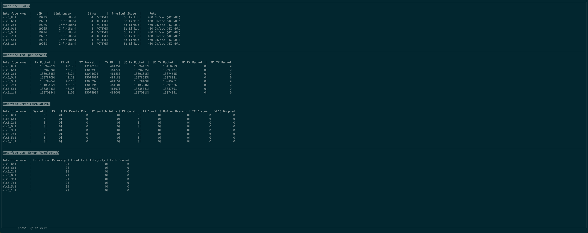

# ib-traffic-monitor

## Intro

`ib-traffic-monitor` is a tool to monitor the local InfiniBand device metrics under Linux operating system. It is written in C and utilizing [ncurses](https://invisible-island.net/ncurses/) as the TUI library.

## Screenshot



## Metrics List

`ib-traffic-monitor` reports following metrics

| Category | Metric Name | Unit | Description |
| --- | --- | --- | --- |
| Interface Status | LID | n/a | Local Identifier |
| Interface Status | Link Layer | n/a | link layer type |
| Interface Status | State | n/a | port state |
| Interface Status | Physical State | n/a | port physical state |
| Interface Status | Rate | n/a | port data rate |
| Interface I/O | RX Packet | packet/second | number of received packets per second |
| Interface I/O | RX MB | MB/second | number of received bytes per second |
| Interface I/O | TX Packet | packet/second | number of transmitted packets per second |
| Interface I/O | TX MB | MB/second | number of transmitted bytes per second |
| Interface I/O | UC RX Packet | packet/second | number of received unicast packets per second |
| Interface I/O | UC TX Packet | packet/second | number of transmitted unicast packets per second |
| Interface I/O | MC RX Packet | packet/second | number of received multicast packets |
| Interface I/O | MC TX Packet | packet/second | number of transmitted multicast packets |
| Interface Error | Symbol | count | number of minor link errors detected on one or more physical lanes |
| Interface Error | RX | packet | number of packets containing an error that were received on the port |
| Interface Error | RX Remote PHY | packet | number of packets marked with the EBP delimiter received on the port |
| Interface Error | RX Switch Relay | packet | number of packets received on the port that were discarded |
| Interface Error | RX Const. | packet | number of packets received on the switch physical port that are discarded |
| Interface Error | TX Const. | packet | number of packets not transmitted from the switch physical port |
| Interface Error | Buffer Overrun | count | number of input buffer overrun |
| Interface Error | TX Discard | packet | number of outbound packets discarded |
| Interface Error | VL15 Dropped | packet | number of incoming VL15 packets dropped |
| Interface Link Error | Link Error Recovery | count | number of times the Port Training state machine has successfully completed the link error recovery process |
| Interface Link Error | Link Error Downed | count | number of times the Port Training state machine has failed the link error recovery process and downed the link |
| Interface Link Error | Local Link Integrity | count | number of times the count of local physical errors exceeded the threshold |

## Compilation

```
$ make
gcc -g -Wall -Wextra -Wpedantic -Wconversion -Wdouble-promotion -Wno-unused-parameter -Wno-unused-function -Wno-sign-conversion -fsanitize=undefined -I. -c -o ib-traffic-monitor.o ib-traffic-monitor.c
gcc -g -Wall -Wextra -Wpedantic -Wconversion -Wdouble-promotion -Wno-unused-parameter -Wno-unused-function -Wno-sign-conversion -fsanitize=undefined -I. -c -o infiniband.o infiniband.c
gcc -g -Wall -Wextra -Wpedantic -Wconversion -Wdouble-promotion -Wno-unused-parameter -Wno-unused-function -Wno-sign-conversion -fsanitize=undefined -I. -c -o utils.o utils.c
gcc -g -Wall -Wextra -Wpedantic -Wconversion -Wdouble-promotion -Wno-unused-parameter -Wno-unused-function -Wno-sign-conversion -fsanitize=undefined -I. -c -o ncurses_utils.o ncurses_utils.c
gcc -g -Wall -Wextra -Wpedantic -Wconversion -Wdouble-promotion -Wno-unused-parameter -Wno-unused-function -Wno-sign-conversion -fsanitize=undefined -I. -o ib-traffic-monitor ib-traffic-monitor.o infiniband.o utils.o ncurses_utils.o -lncurses
```

## Usage

Users can simply run `ib-traffic-monitor` without any options. The default refresh period is 5 seconds.

If `ib-traffic-monitor` cannot not detect any valid InfiniBand device, the program will exit with error.

```
$ ./ib-traffic-monitor -h
InfiniBand Traffic Monitor - Version 1.3.2
usage: ib-traffic-monitor [-r|--refresh <second(s)>]
                          [-e|--ethernet]
                          [-h|--help]
```

`-r` or `--refresh`: specify the refresh period. the unit is second

`-e` or `--ethernet`: show Ethernet link layer type devices. the default behavior is showing InfiniBand link layer devices only

`-h` or `--help`: show help message

## ChangeLog

```
[03/24/2025] 1.0.0 - initial commit

[03/25/2025] 1.1.0 - add flag to show Ethernet link layer type device

[05/11/2025] 1.2.0 - optimize program quitting in non-blocking style

[05/16/2025] 1.3.0 - handle SIGINT signal gracefully

[05/20/2025] 1.3.1 - fix typo on port_rcv_constraint_errors metric

[05/24/2025] 1.3.2 - update version string
```

## Reference

[Linux sysfs interface common for all infiniband devices](https://www.kernel.org/doc/Documentation/ABI/stable/sysfs-class-infiniband)

[Understanding mlx5 Linux Counters and Status Parameters](https://enterprise-support.nvidia.com/s/article/understanding-mlx5-linux-counters-and-status-parameters)
